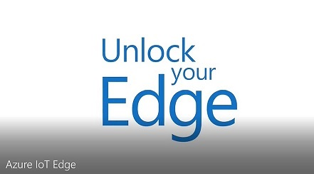

# Modern IoT Data Analytics for Industrial IoT (IIoT) Use cases

This article describes a side-by-side showdown of traditional data analytics and IoT data analytics, highlighting the key differences and the advantages of using IoT data in decision making. Imagine having access to real-time data from various connected devices and being able to analyze them as they happen, giving you an edge over your competition. We'll dive into the unique challenges that come with IoT data analytics and how to overcome them, as well as the new opportunities it opens up for businesses. Lets start an exciting journey into the world of IoT data analytics and the future of decision making.

## Content Outline

------------------

We are going to discuss the following topics to strengthen our understanding of overall Data Analytics paradigm and how it
applies to the Industrial IoT (IIoT) use cases within Azure ecosystem.

Here are the topics we will dive into:

* **Modern Data Architecture in Azure**
  * *We will start discussing a typical Data analytics scenario and lifecycle of a given data analytics application. We will then define a logical architecture of the data analytics application and how it helps building a physical one in Azure. We will look at the key platform services on the Azure platform and how it simplify the application development.*
  
* **How to think about applying ref architecture to Industrial IoT Use cases**
  * *Azure Data analytics reference architecture defined in earlier section paves the way for us to start thinking about the machine data from the factory floors and broader IoT use cases in the industrial scenarios. In this section, We will review what are the typical considerations dealing with Industrial machines data and the use cases surround that.*
  
* **Unified Architecture & Business Value for Manufacturing Org**
  * *Once we understand the Industrial IoT data analytics paradigm, we will look at a typical Manufacturing organization with a large geographical presence across the globe. We will try to understand what are the business drivers and how Azure presents a compelling value prop to build a unified enterprise data analytics platform for deriving business values.*

* **Demos – OT/IT Data Contextualization & ML @ Edge**
  * *In this section, we will review couple of use cases which are implemented on the unified platform. First we will look at heterogeneous machines data contextualization in the Azure Cloud to build a semantic layer for the machine datasets for analytics. Second use case will show how to operationalize the Machine learning use case on the edge by implementing custom vision model on the edge for predictive quality inspection for the manufacturing site.*

## Modern Data Architecture in Azure

------------------

TBD

## How to think about applying ref architecture to Manufacturing Use cases

------------------

TBD

## Unified Architecture & Business Value for Manufacturing Org

------------------

TBD

## Demos – OT/IT Data Contextualization & ML @ Edge

------------------

TBD
